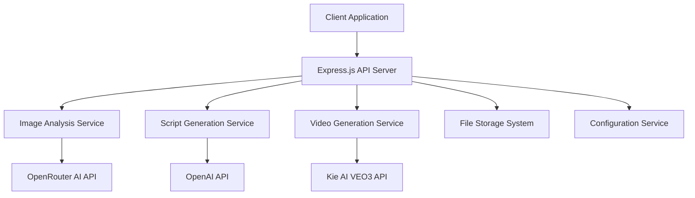

# Design Document

## Overview

The UGC Ad Creator API is a Node.js RESTful server that processes creative briefs and multiple images to generate User Generated Content advertisements. The system leverages AI services (OpenAI for script generation, OpenRouter for image analysis, and Kie AI for video generation) to create a complete workflow from concept to final video output.

The architecture follows a microservices-inspired approach with clear separation of concerns, using Express.js as the web framework and integrating with multiple external AI services through HTTP APIs.

## Architecture

### High-Level Architecture



### Service Layer Architecture

The application is structured in layers:

1. **Controller Layer**: Handles HTTP requests/responses and input validation
2. **Service Layer**: Contains business logic for each major workflow component
3. **Integration Layer**: Manages external API communications
4. **Utility Layer**: Provides common functionality like file handling and configuration

## Components and Interfaces

### Core Components

#### 1. API Controller (`/src/controllers/ugcController.js`)
- Handles multipart file uploads for images
- Validates creative brief and optional script inputs
- Orchestrates the workflow between services
- Returns structured JSON responses

**Key Methods:**
- `POST /api/ugc/generate` - Main endpoint for UGC generation
- Input validation for images, creative brief, and optional script
- Error handling and response formatting

#### 2. Image Analysis Service (`/src/services/imageAnalysisService.js`)
- Processes multiple uploaded images
- Integrates with OpenRouter AI using Gemini model
- Extracts detailed descriptions of image content
- Combines analysis results for script generation context

**Key Methods:**
- `analyzeImages(imageFiles)` - Analyzes all uploaded images
- `analyzeImage(imageBuffer, mimeType)` - Analyzes single image
- `formatImageForAPI(imageBuffer, mimeType)` - Converts image to base64 for API

#### 3. Script Generation Service (`/src/services/scriptGenerationService.js`)
- Generates or refines video scripts using OpenAI
- Combines creative brief, image analysis, and optional script
- Ensures scripts reference only visible elements from images
- Returns structured 2-segment video scripts

**Key Methods:**
- `generateScript(creativeBrief, imageAnalysis, optionalScript)` - Main script generation
- `buildPrompt(creativeBrief, imageAnalysis, optionalScript)` - Constructs AI prompt
- `validateScriptOutput(scriptResponse)` - Validates AI response structure

#### 4. Video Generation Service (`/src/services/videoGenerationService.js`)
- Integrates with Kie AI VEO3 API for video generation
- Handles asynchronous video processing with polling
- Manages multiple video segments and merging
- Provides status tracking for long-running operations

**Key Methods:**
- `generateVideo(script, images)` - Initiates video generation
- `pollVideoStatus(taskId)` - Polls for completion status
- `mergeVideoSegments(videoUrls)` - Combines multiple video segments
- `downloadVideo(videoUrl)` - Downloads final video content

### External API Integrations

#### OpenRouter AI Integration
- **Endpoint**: `https://openrouter.ai/api/v1/chat/completions`
- **Model**: `google/gemini-2.5-flash-image-preview:free`
- **Purpose**: Image analysis and description
- **Authentication**: Bearer token via API key

#### OpenAI Integration
- **Endpoint**: `https://api.openai.com/v1/chat/completions`
- **Model**: Configurable (default: gpt-4)
- **Purpose**: Script generation and refinement
- **Authentication**: Bearer token via API key

#### Kie AI Integration
- **Generate Endpoint**: `https://api.kie.ai/api/v1/veo/generate`
- **Status Endpoint**: `https://api.kie.ai/api/v1/veo/record-info`
- **Purpose**: Video generation from scripts and images
- **Authentication**: Bearer token via API key

## Data Models

### Request Models

#### UGC Generation Request
```typescript
interface UGCGenerationRequest {
  creativeBrief: string;           // Required: Campaign description and goals
  images: File[];                  // Required: 1-N image files
  script?: string;                 // Optional: User-provided script
  maxImages?: number;              // Optional: Override default max images
}
```

#### Image Analysis Result
```typescript
interface ImageAnalysis {
  imageIndex: number;
  description: string;
  objects: string[];
  people: string[];
  setting: string;
  actions: string[];
}
```

### Response Models

#### Script Generation Response
```typescript
interface ScriptResponse {
  "segment-1": string;             // 7-8 second video segment description
  "segment-2": string;             // 7-8 second video segment description
}
```

#### UGC Generation Response
```typescript
interface UGCResponse {
  success: boolean;
  data: {
    script: ScriptResponse;
    videoUrl?: string;             // Present when video generation succeeds
    imageAnalysis: ImageAnalysis[];
  };
  error?: string;
}
```

### Internal Data Models

#### Video Generation Task
```typescript
interface VideoTask {
  taskId: string;
  status: 'pending' | 'processing' | 'completed' | 'failed';
  segment: number;
  createdAt: Date;
  completedAt?: Date;
  resultUrl?: string;
}
```

## Error Handling

### Error Categories

1. **Validation Errors (400)**
   - Missing creative brief
   - No images uploaded
   - Too many images
   - Invalid file formats

2. **External Service Errors (502/503)**
   - OpenRouter API failures
   - OpenAI API failures
   - Kie AI API failures
   - Network timeouts

3. **Processing Errors (500)**
   - Image processing failures
   - Script parsing errors
   - Video merging failures

### Error Response Format

```typescript
interface ErrorResponse {
  success: false;
  error: {
    code: string;
    message: string;
    details?: any;
  };
}
```

### Retry Logic

- **Image Analysis**: 3 retries with exponential backoff
- **Script Generation**: 2 retries with 1-second delay
- **Video Generation**: Status polling with 60-second intervals, 30-minute timeout

## Testing Strategy

### Unit Testing
- **Framework**: Jest
- **Coverage Target**: 80%
- **Focus Areas**:
  - Service layer business logic
  - Data transformation functions
  - Error handling scenarios
  - Input validation

### Integration Testing
- **External API Mocking**: Use nock for HTTP request mocking
- **File Upload Testing**: Use supertest with multipart form data
- **End-to-End Workflow**: Test complete UGC generation flow with mocked APIs

### Test Structure
```
/tests
  /unit
    /services
      - imageAnalysisService.test.js
      - scriptGenerationService.test.js
      - videoGenerationService.test.js
    /controllers
      - ugcController.test.js
  /integration
    - ugcWorkflow.test.js
  /fixtures
    - sample-images/
    - mock-responses/
```

### Performance Testing
- **Load Testing**: Artillery.js for API endpoint load testing
- **Memory Testing**: Monitor memory usage during large image processing
- **Timeout Testing**: Verify proper handling of long-running video generation

### Security Testing
- **Input Validation**: Test malicious file uploads and oversized requests
- **API Key Security**: Verify proper environment variable handling
- **Rate Limiting**: Test API rate limiting implementation